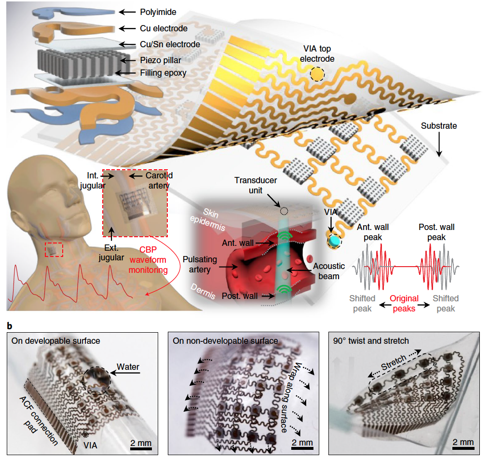

- [Google Scholar](https://scholar.google.ca/citations?user=EPNkqd0AAAAJ&hl=en)

## Journal Article
{: width="250" height="250"}
- Chonghe Wang, Xiaoshi Li, Hongjie Hu, Lin Zhang, Zhenlong Huang, Muyang Lin, Zhuorui Zhang, **Zhenan Yin**, Brady Huang, Hua Gong, Shubha Bhaskaran, Yue Gu, Mitsutoshi Makihata, Yuxuan Guo, Yusheng Lei, Yimu Chen, Chunfeng Wang, Yang Li, Tianjiao Zhang, Zeyu Chen, Albert P. Pisano, Liangfang Zhang, Qifa Zhou, Sheng Xu. [Monitoring of the central blood pressure waveform via a conformal ultrasonic device](https://www.nature.com/articles/s41551-018-0287-x). **Nature Biomedical Engineering**, 2019.

