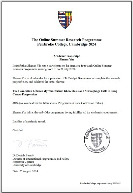

---
### The Connection Between Mtb and Macrophage Cells in Lung Cancer Progression

{: width="150" height="225"}

- University of Cambridge, Pembroke College      _July 1st - July 28th,2024_
- Advised by [**Dr. Bridget P. Bannerman**](https://crukcambridgecentre.org.uk/users/bpc2814870) and [**Prof. Jorge Júlvez**](https://webdiis.unizar.es/~julvez/)
- Investigated the role of Mycobacterium tuberculosis (Mtb) and macrophage cells in the development of lung cancer.
- Employed genome-scale metabolic models and utilized COBRApy for Flux Balance Analysis (FBA) and Flux Variability Analysis (FVA) to predict and assess the metabolic network’s behavior and robustness under varying conditions.
- Identified potential drug targets and authored a report titled _The Connection Between Mycobacterium Tuberculosis and Macrophage Cells in Lung Cancer Progression_

| Model Name | Reactions | Essential Reactions |
| ---------- | --------- | ------------------- |
| Macrophage | 3393      | 117                 |
| Mycobacterium Tuberculosis(mtb) | 4484 | 375 |
| -----------| --------- | ------------------- |
| Drug Targets | 223                           |

---
### Triton Town Autonomous Vehicle

---
### Plankton Image Labeling and Retrieval System Using Deep Learning

---
### Conformal Ultrasonic Device for Central Blood Pressure Waveform Monitoring

---
### Control System Project - The Vending Machine

