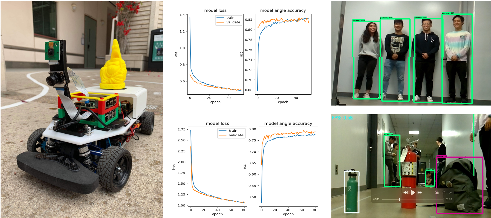
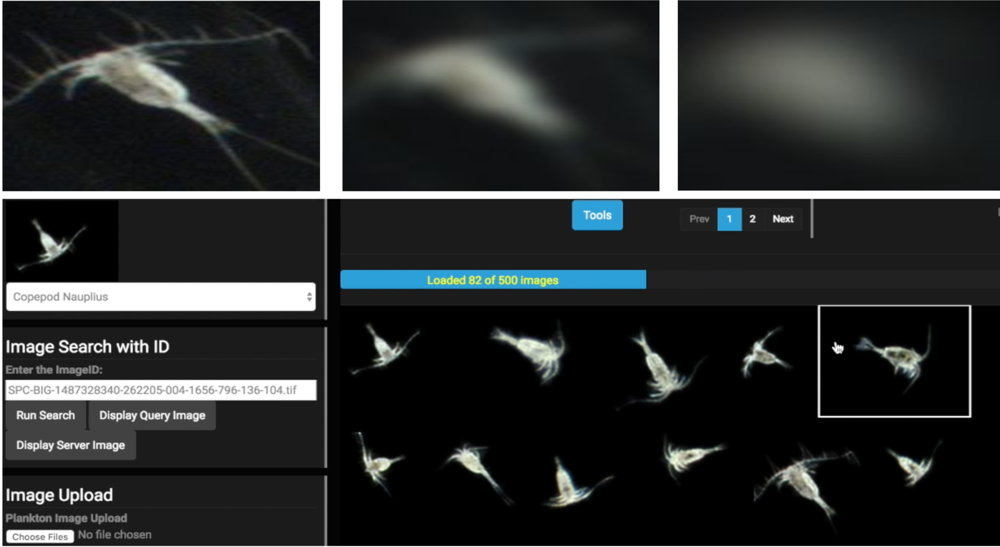
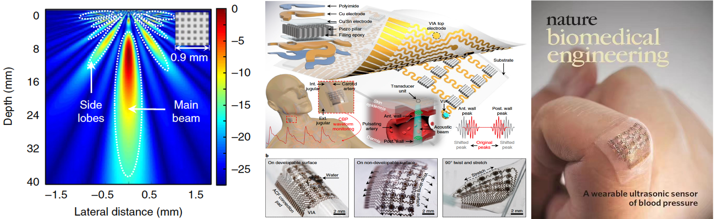
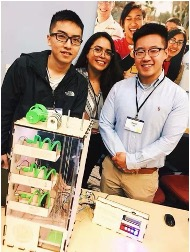

---
### The Connection Between Mtb and Macrophage Cells in Lung Cancer Progression

{: width="250" height="325"}

- University of Cambridge - Pembroke College, _July 1st - July 28th,2024_
- Advised by [**Dr. Bridget P. Bannerman**](https://crukcambridgecentre.org.uk/users/bpc2814870) and [**Prof. Jorge Júlvez**](https://webdiis.unizar.es/~julvez/)
- Investigated the role of Mycobacterium tuberculosis (Mtb) and macrophage cells in the development of lung cancer.
- Employed genome-scale metabolic models and utilized COBRApy for Flux Balance Analysis (FBA) and Flux Variability Analysis (FVA) to predict and assess the metabolic network’s behavior and robustness under varying conditions.
- Identified potential drug targets and authored a report titled _The Connection Between Mycobacterium Tuberculosis and Macrophage Cells in Lung Cancer Progression_

| Model Name | Reactions | Essential Reactions |
| ---------- | --------- | ------------------- |
| Macrophage | 3393      | 117                 |
| Mycobacterium Tuberculosis(mtb) | 4484 | 375 |
| -----------| --------- | ------------------- |
| Drug Targets | 223                           |
| ---------- | ------------------------------- |

---
### Triton Town Autonomous Vehicle

{: width="350" height="350"}

- University of California, San Diego, _February 2019 - June 2019_
- Advised by [**Associate Prof. Maurício de Oliveira**](https://jacobsschool.ucsd.edu/people/profile/mauricio-de-oliveira) and [**Associate Prof. Jack Silberman**](https://jacobsschool.ucsd.edu/cosmos/jack-silberman)
- Integrated electronic components to design and fabricate the circuit, coupling it with Raspberry Pi to build the reliable hardware foundation for the autonomous vehicle.
- Installed and configured TensorFlow, OpenCV, and Donkey library, optimizing the vehicle’s design and reducing the failure rate from 25% to 3% after 20 test runs.
- Collected and processed 35,000 image data points and implemented deep learning algorithms to train autonomous driving models on GPU clusters, enabling the vehicle to successfully complete 10 indoor and 6 outdoor laps consecutively in full autopilot mode.
- Applied convolutional neural networks (CNN) on the CIFAR-100 dataset to train an object detection model, achieving at least 85% accuracy during autonomous driving.

| Lighting Variation | Training Sample Size | Indoor Track | Outdoor Track |
| ------------------ | -------------------- | ------------ | ------------- |
| Before             | 250000 images        | 8 laps       | 2 laps        |
| After              | 350000 images        | 10 laps      | 6 laps        |
| ------------------ | -------------------- | ------------ | ------------- |
| Object Detection   | 85%                                                 |
| ------------------ | -------------------- | ------------ | ------------- |

---
### Plankton Image Labeling and Retrieval System Using Deep Learning

{: width="350" height="350"}

- University of California, San Diego, _November 2017 - May 2019_
- **Undergraduate Research Assistant** in [Statistical Visual Computing Lab (SVCL)](http://www.svcl.ucsd.edu/), advised by [**Prof. Nuno Vasconcelos**](https://jacobsschool.ucsd.edu/people/profile/nuno-vasconcelos) 
- Developed a plankton image labeling and retrieval system to assist scientists at the Scripps Institute of Oceanography in analyzing environmental changes in the ocean.
- Implemented data augmentation using Keras and Tensorflow to expand labeled dataset size 2x, increased data diversity and improved model generalization, classification accuracy, and resistance to blurry images.
- Applied transfer learning using ResNet-50 as baseline model, coupled with augmented dataset, resulting in significant performance improvement (from 65% to 90 %) for multi-class plankton image classification.
- Accelerated plankton image labeling by a factor of 10, processing 1 billion images far more efficiently compared to manual labeling.

---
### Conformal Ultrasonic Device for Central Blood Pressure Waveform Monitoring

{: width="350" height="350"}

- University of California, San Diego, _May 2017 - December 2018_
- **Undergraduate Research Assistant** in [Xu Research Group](https://xugroup.eng.ucsd.edu/), advised by [**Prof. Sheng Xu**](https://jacobsschool.ucsd.edu/people/profile/sheng-xu) 
- Fabricated a conformal ultrasonic probe using stretchable circuit patterning, laser cutting for precise printing transfer, and soft elastomeric packaging for flexibility and durability.
- Simulated the ultrasound beam pattern and maximum penetration depth of the transducer using MATLAB and the TAC_GUI toolbox, incorporating key theoretical parameters to generate a prediction plot.
- Analyzed the prediction plot alongside experimental data to validate that the transducer’s real-world performance in terms of penetration depth and ultrasound beam pattern aligns with theoretical expectations.
- Prepared comprehensive documentation, including supporting evidence and a risk response plan, to address the UC San Diego Institutional Review Board’s (IRB) concerns regarding human subject experiments.
- Contributed to the publication of "_Monitoring of the Central Blood Pressure Waveform via a Conformal Ultrasonic Device_" in _Nature Biomedical Engineering_.

---
### Control System Project - The Vending Machine
{: width="250" height="350"}

- University of California, San Diego, _April 2018 - June 2018_
- Advised by [**Alex Phan, Ph.D.**](https://jacobsschool.ucsd.edu/idea/about/staff/phan) 
- Designed a three-level vending machine using SolidWorks, incorporating 3D-printed delivery trays, spiral ejectors, product selection buttons, and laser-cut plywood and acrylic for the main body structure.
- Programmed the vending machine's control algorithm using NI myDAQ and LabVIEW, achieving instantaneous response upon pressing the product selection button.
- Awarded with the most reliable device, and earned LabVIEW Associate Developer Certificate from National Instruments.
